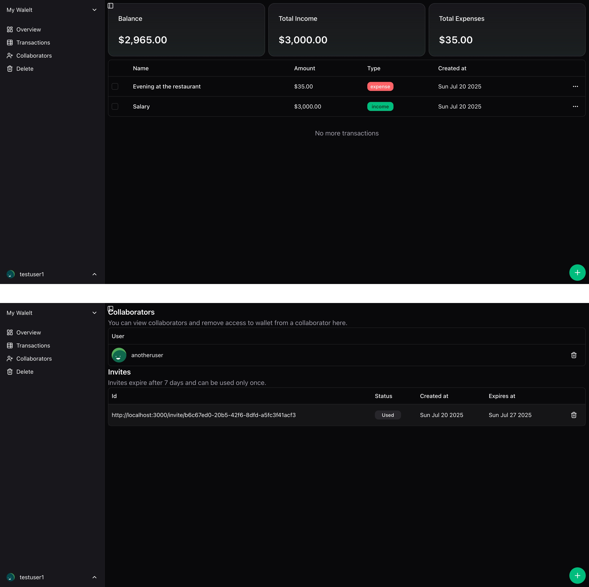

# CashFlow

A **full-stack expense tracking application** to help you manage your finances, track spending, and
collaborate on shared wallets. CashFlow makes it easy to monitor income, expenses, and budgets with
a modern, intuitive interface.

## Features

-   **Minimalist Design** 🎨
    -   Clean, distraction-free UI focused on simplicity and usability.
-   **Secure Authentication** 🔐
    -   Register and log in with JWT-based authentication.
-   **Wallet Management & Insights** 🪄📊
    -   Create and manage multiple wallets for different purposes.
    -   Instantly view wallet balance, total income, and total expense.
    -   Share wallets via invite links and manage collaborators.
    -   Remove or accept wallet access with ease.
-   **Transaction Tracking** 📝
    -   Add, edit, and delete income or expense transactions.
    -   Bulk delete multiple transactions for efficient management.
    -   Paginated transaction history—load more with a button, never overload your device.
-   **User Profile Management** 👤
    -   Change your username and password securely from your profile settings.
-   **Collaboration** 🤝
    -   Invite others to shared wallets and manage access.
-   **Rate Limiting & Security** 🚦
    -   Protects the API from abuse and ensures fair usage for all users.
    -   Robust error handling and validation for a safe, reliable experience.

## Screenshots



## Technologies Used

**Frontend:**

-   **Next.js**: Modern React framework for building the UI.
-   **Tailwind CSS**: Utility-first styling for rapid development.
-   **TypeScript**: Type safety and better developer experience.
-   **React Query**: Data fetching and caching.
-   **Axios**: HTTP requests.
-   **Shadcn/ui**: Accessible, customizable UI components.

**Backend:**

-   **Node.js**: Server-side runtime.
-   **NestJS**: Scalable RESTful API framework.
-   **Prisma**: Database ORM.
-   **PostgreSQL**: Reliable, production-grade database.
-   **JWT**: Authentication.
-   **Bcrypt**: Password hashing.
-   **Class Validator/Transformer**: Data validation.
-   **Swagger**: API documentation and interactive API exploration.

**DevOps & Testing:**

-   **Docker & Docker Compose**: Containerization and orchestration.
-   **Jest**: Backend unit testing.


## Usage

1. **Sign Up & Log In**
    - Create an account or log in securely.
2. **Wallet Management**
    - Create personal or shared wallets.
    - Invite collaborators and manage access.
    - Instantly view wallet balances and insights.
3. **Transaction Management**
    - Add, edit, or delete income and expense transactions.
    - Use bulk actions for efficient management.
    - Load more transactions as needed.
4. **Profile Settings**
    - Update your username and password anytime.
5. **Collaboration**
    - Accept wallet invites and work together with others.

### Running the Demo

To quickly get a demo of the application up and running, you can use the provided npm scripts.

**Prerequisites:**

-   You must have Docker installed.

**Commands:**

-   To start the demo environment:

    ```bash
    pnpm run demo:start
    ```

    This will build and start the necessary services in detached mode.

-   To stop the demo environment:
    ```bash
    pnpm run demo:stop
    ```
    This will stop the running containers.

## License

This project is licensed under the MIT License - see the LICENSE file for details.
